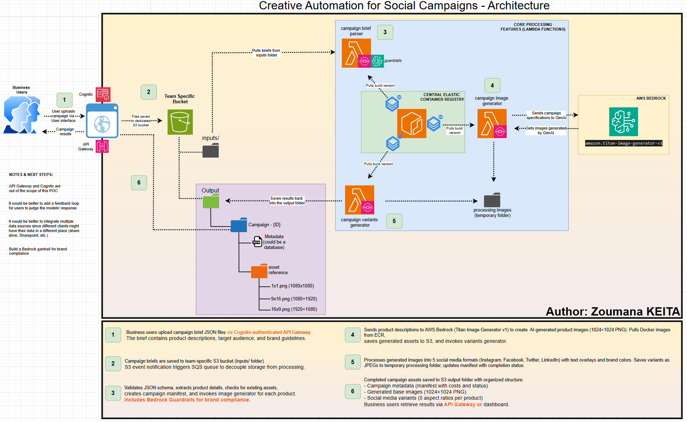

# Creative Automation Service

**Serverless AI-powered social media campaign generator using AWS Bedrock Titan**

---

## Introduction
-------------------------------------------------------------------------------

### Overview

Creative Automation Service is a fully serverless AWS solution that automatically generates professional social media campaign assets using AI. Upload a campaign brief JSON file, and the system produces multiple platform-optimized images with branded overlays—all tracked with detailed cost analytics.

### What It Does

1. Upload campaign brief (JSON) with product names and descriptions
2. Generate AI images using Amazon Bedrock Titan Image Generator ($0.04/image)
3. Create 5 social media variants with text overlays (Instagram, Facebook, Twitter, LinkedIn)
4. Deliver organized S3 output with complete cost tracking

Performance: ~30 seconds per product | Cost: ~$0.05 per product

### Key Features

- Fully Serverless: Built on AWS Lambda, S3, SQS, and Bedrock
- AI-Powered: Uses Amazon Bedrock Titan Image Generator for high-quality images
- Multi-Format: Automatically generates 5 social media aspect ratios
- Cost Tracking: Complete transparency with per-campaign cost breakdown
- Streamlit Dashboard: User-friendly web interface for campaign management
- Infrastructure as Code: Full Terraform deployment for reproducibility

### Use Cases

- Marketing teams launching multi-product campaigns
- E-commerce businesses creating product showcases
- Social media managers needing platform-optimized content
- Agencies managing multiple client campaigns

---

## High-Level Architecture
-------------------------------------------------------------------------------



### System Components

```
Campaign Brief (JSON)
        ↓
    S3 Bucket (Event Notification)
        ↓
    SQS Queue (Decoupling)
        ↓
┌─────────────────────────────────┐
│  Lambda 1: Parser               │
│  • Validates JSON schema        │
│  • Creates campaign manifest    │
│  • Checks for existing assets   │
└────────────┬────────────────────┘
             ↓
┌─────────────────────────────────┐
│  Lambda 2: Generator            │
│  • Calls Bedrock Titan API      │
│  • Generates 1024×1024 PNG      │
│  • Saves to S3 (generated/)     │
└────────────┬────────────────────┘
             ↓
┌─────────────────────────────────┐
│  Lambda 3: Variants             │
│  • Resizes to 5 formats         │
│  • Adds text overlays           │
│  • Applies brand colors         │
│  • Saves JPEGs to S3            │
└────────────┬────────────────────┘
             ↓
    S3 Output Folder
    (Campaign Results + Manifest)
```


### Processing Flow Details

**Step 1: Campaign Upload**
- Business users upload campaign brief JSON via S3
- Brief contains product descriptions, target audience, and brand guidelines

**Step 2: S3 Storage & Event Trigger**
- Campaign briefs saved to S3 bucket (inputs/ folder)
- S3 event notification triggers SQS queue for decoupled processing

**Step 3: Campaign Brief Parser (Lambda)**
- Validates JSON schema and extracts product details
- Checks for existing assets to reuse
- Creates campaign manifest with metadata
- Invokes image generator for each product

**Step 4: Campaign Image Generator (Lambda)**
- Sends product descriptions to AWS Bedrock Titan Image Generator v1
- Generates AI-powered product images (1024×1024 PNG)
- Pulls Docker images from ECR
- Saves generated assets to S3
- Invokes variants generator

**Step 5: Campaign Variants Generator (Lambda)**
- Processes generated images into 5 social media formats
- Adds text overlays with campaign message and brand colors
- Creates platform-specific variants (Instagram, Facebook, Twitter, LinkedIn)
- Saves variants as JPEGs to S3
- Updates manifest with completion status

**Step 6: Output & Results**
- Completed campaign assets organized in S3 output folder
- Campaign metadata with costs and processing time
- Generated base images (1024×1024 PNG)
- Social media variants (5 aspect ratios per product)
- Users retrieve results via Streamlit dashboard or AWS CLI


-------------------------------------------------------------------------------
Lambda Functions Specifications
-------------------------------------------------------------------------------

| Function | Purpose | Memory | Timeout | Cost per Invocation |
|----------|---------|--------|---------|---------------------|
| **Parser** | Validate JSON, create manifest | 512 MB | 300s | $0.0001 |
| **Generator** | Bedrock Titan image generation | 1024 MB | 120s | $0.04/image |
| **Variants** | Resize + overlay for 5 platforms | 2048 MB | 180s | $0.0011 |

**Total Cost per Product**: ~$0.05 (AI generation + processing + storage)

### Technology Stack

- **Compute**: AWS Lambda (Python 3.11) with Docker containers
- **AI/ML**: Amazon Bedrock (Titan Image Generator v1)
- **Storage**: Amazon S3 (input/output buckets)
- **Messaging**: Amazon SQS (event queue + DLQ)
- **Registry**: Amazon ECR (container images)
- **Monitoring**: CloudWatch Logs & Metrics
- **IaC**: Terraform (infrastructure management)
- **Dashboard**: Streamlit (Python web framework)

---

## Prerequisites
-------------------------------------------------------------------------------

### Required Tools & Accounts

1. **AWS Account** with access to:
   - Amazon Bedrock (Titan Image Generator)
   - S3, Lambda, SQS, ECR, IAM, CloudWatch
   
2. **Development Tools**:
   - [AWS CLI v2](https://docs.aws.amazon.com/cli/latest/userguide/getting-started-install.html) - AWS command-line interface
   - [Terraform](https://www.terraform.io/downloads) (v1.5+) - Infrastructure as Code
   - [Docker Desktop](https://www.docker.com/products/docker-desktop/) - Container runtime
   - [Python 3.11+](https://www.python.org/downloads/) - For local development & dashboard

### AWS Configuration

Before deployment, ensure:
- AWS account has permissions for Lambda, S3, SQS, ECR, IAM, Bedrock
- Bedrock Titan Image Generator model access is enabled (see setup below)
- AWS CLI is configured with valid credentials

---

---

## How to Use
-------------------------------------------------------------------------------

### Step 1: Enable Amazon Bedrock Model Access

**In AWS Console:**

1. Search for "Bedrock" in the AWS Console search bar
2. In the bottom left, under "Configuration and learn", select **Model access**
3. From that page, select **"Model catalog"**
4. Under "Providers", select **"Amazon"**
5. Under "Modality", select **"Images"**
6. Choose **"Titan Image Generator G1"**
7. Click **"Request model access"** (approval is usually instant)
8. Wait ~2-5 minutes for status to change to **"Access granted"**

**Verify access:**
```bash
aws bedrock list-foundation-models --region us-east-1 | grep titan-image
```

### Step 2: Configure AWS Credentials

```bash
aws configure
# AWS Access Key ID: <your-key>
# AWS Secret Access Key: <your-secret>
# Default region: us-east-1 (required for Bedrock)
# Default output format: json

# Verify configuration
aws sts get-caller-identity
```

### Step 3: Clone Repository and Configure

```bash
git clone https://github.com/keitazoumana/creative-automation-service.git
cd creative-automation-service

# Edit terraform/environments/dev.tfvars
# Update the following values:
# - aws_account_id: Your AWS account ID (from step 2)
# - s3_bucket_name: Globally unique bucket name (e.g., creative-automation-yourname-2025)
```

**Example `dev.tfvars`:**
```hcl
aws_account_id = "123456789012"
aws_region     = "us-east-1"
s3_bucket_name = "creative-automation-yourname-2025"  # Must be globally unique
```

### Step 4: Build and Push Lambda Containers

```bash
cd scripts
./build-and-push.sh dev v1.0.0
```

**This will:**
- Build 3 Docker container images
- Push to ECR with versioned tags
- Update Lambda functions with new images

Expected time: ~5-10 minutes (first build)

### Step 5: Deploy Infrastructure with Terraform

```bash
cd ../terraform
./deploy.sh dev --auto-approve
```

**Deployment creates:**
- 1 S3 bucket (campaign storage)
- 1 SQS queue (+ Dead Letter Queue)
- 3 ECR repositories (Docker images)
- 3 Lambda functions (parser, generator, variants)
- IAM roles and policies
- CloudWatch log groups

Expected time: ~3 minutes

### Step 6: Launch Streamlit Dashboard

```bash
cd ..
./run-dashboard.sh
# Opens at http://localhost:8501
```

---

### Usage Options

#### Option 1: Streamlit Dashboard (Recommended for Business Users)

**Launch the dashboard:**
```bash
./run-dashboard.sh
```

**Workflow:**
1. Open `http://localhost:8501` in your browser
2. Navigate to "Create Campaign" tab
3. Choose one of:
   - **Upload JSON file** - Upload pre-prepared campaign brief
   - **Use form builder** - Fill out campaign details interactively
   - **Select template** - Start from example campaign
4. Click "Launch Campaign"
5. Monitor progress in "Track Progress" tab
6. View and download results in "View Results" tab

**Dashboard Features:**
- Real-time metrics (campaigns, costs, products)
- Interactive campaign builder with validation
- Live Lambda logs with filtering
- Image preview and bulk download
- Cost tracking per campaign

**Dashboard in Action:**


#### Option 2: AWS CLI (For Automation & Developers)

**Upload campaign brief directly to S3:**
```bash
# Upload campaign brief (auto-triggers pipeline)
aws s3 cp examples/campaign-briefs/01-simple-nike.json \
  s3://YOUR-BUCKET-NAME/input/campaign-briefs/

# Monitor Lambda logs in real-time
aws logs tail /aws/lambda/dev-creative-automation-generator --follow

# Check campaign status
aws s3 ls s3://YOUR-BUCKET-NAME/output/

# Download results
aws s3 sync s3://YOUR-BUCKET-NAME/output/campaign-name-timestamp/ ./local-results/
```

#### Option 3: Try Example Campaigns

**Pre-built examples in `examples/campaign-briefs/`:**

```bash
# 1. Simple Nike campaign (2 products)
aws s3 cp examples/campaign-briefs/01-simple-nike.json \
  s3://YOUR-BUCKET-NAME/input/campaign-briefs/

# 2. Multi-product Apple campaign (3 products)
aws s3 cp examples/campaign-briefs/02-multi-product-apple.json \
  s3://YOUR-BUCKET-NAME/input/campaign-briefs/

# 3. Hybrid fashion campaign (mix of generated + existing assets)
aws s3 cp examples/campaign-briefs/03-hybrid-fashion.json \
  s3://YOUR-BUCKET-NAME/input/campaign-briefs/

# 4. French luxury fashion (4 products, non-English)
aws s3 cp examples/campaign-briefs/04-french-fashion.json \
  s3://YOUR-BUCKET-NAME/input/campaign-briefs/
```

---

### Campaign Brief Format

**Minimum Required Fields:**

```json
{
  "campaign_name": "Spring Collection 2025",
  "campaign_message": "Fresh styles for the new season",
  "target_audience": "Fashion-conscious millennials aged 25-40",
  "target_regions": ["US", "CA"],
  "products": [
    {
      "name": "Summer Dress",
      "description": "Floral print midi dress with flowing fabric"
    },
    {
      "name": "Beach Sandals", 
      "description": "Comfortable leather sandals with arch support"
    }
  ]
}
```

**Optional Fields:**
- `brand_colors`: Array of hex colors (e.g., `["#FF6B35", "#FFFFFF"]`)
- `existing_asset_url`: S3 path to reuse existing product images (saves $0.04/product)

**Requirements:**
- ✅ Minimum 2 products per campaign
- ✅ Valid JSON format
- ✅ Product descriptions under 512 characters (Bedrock Titan limit)

**Full examples**: See `examples/campaign-briefs/` directory

---


-------------------------------------------------------------------------------
### Output Structure

**Generated S3 folder structure:**

```
s3://YOUR-BUCKET-NAME/output/
└── campaign-name-20251026-143022/
    ├── manifest.json                    # Status, costs, metadata
    ├── product-name-1/
    │   ├── generated/
    │   │   └── product-name-1-0.png    # AI-generated (1024×1024)
    │   └── aspect-ratios/
    │       ├── 1080x1080/instagram-square.jpg
    │       ├── 1080x1920/instagram-story.jpg
    │       ├── 1200x630/facebook-feed.jpg
    │       ├── 1200x675/twitter-card.jpg
    │       └── 1200x627/linkedin-post.jpg
    └── product-name-2/
        ├── generated/...
        └── aspect-ratios/...
```

**Each product generates:**
- 1 AI-generated base image (1024×1024 PNG)
- 5 social media variants (JPG with text overlays)

**Manifest.json example:**
```json
{
  "campaign_id": "spring-collection-20251026-143022",
  "campaign_name": "Spring Collection 2025",
  "status": "completed",
  "created_at": "2025-10-26T14:30:22Z",
  "completed_at": "2025-10-26T14:31:18Z",
  "processing_time_seconds": 56,
  "total_cost": 0.10,
  "products": [
    {
      "name": "Summer Dress",
      "image_source": "generated",
      "cost": 0.04,
      "variants": { ... }
    }
  ]
}
```

---

### Monitoring & Troubleshooting

#### View Real-Time Logs

```bash
# Parser Lambda (validates briefs)
aws logs tail /aws/lambda/dev-creative-automation-parser --follow

# Generator Lambda (creates AI images)
aws logs tail /aws/lambda/dev-creative-automation-generator --follow

# Variants Lambda (creates social formats)
aws logs tail /aws/lambda/dev-creative-automation-variants --follow

# Filter errors only
aws logs tail /aws/lambda/dev-creative-automation-generator \
  --filter-pattern "ERROR" --since 1h
```

#### Check Queue Status

```bash
# Check messages in queue
aws sqs get-queue-attributes \
  --queue-url <QUEUE_URL> \
  --attribute-names ApproximateNumberOfMessages ApproximateNumberOfMessagesNotVisible

# Check Dead Letter Queue (failed messages)
aws sqs receive-message --queue-url <DLQ_URL> --max-number-of-messages 10
```

#### Common Issues & Solutions

**❌ "AccessDenied: Bedrock model not accessible"**
- **Solution**: Enable Titan Image Generator in AWS Console → Bedrock → Model Access
- **Verify**: Check model status shows "Access granted"

**❌ "S3 bucket already exists"**
- **Solution**: Change `s3_bucket_name` in `dev.tfvars` to a globally unique value
- **Tip**: Add your name or timestamp (e.g., `creative-automation-john-2025`)

**❌ "Lambda timeout after 3 seconds"**
- **Solution**: Verify Bedrock model access is enabled
- **Check**: IAM role has `bedrock:InvokeModel` permission

**❌ "SSL certificate verify failed"**
- **Solution**: Corporate network issue - already fixed with `--no-verify-ssl` flags in scripts
- **Note**: This is pre-configured in `build-and-push.sh` and `run-dashboard.sh`

**❌ "Campaign stuck in 'processing' status"**
- **Check logs**: `aws logs tail /aws/lambda/dev-creative-automation-generator --since 10m`
- **Check queue**: Verify SQS messages are being processed
- **Verify**: Bedrock API is responding (check CloudWatch metrics)

---

---

### Cost Management

**Cost Breakdown (per 2-product campaign):**

| Service | Usage | Cost |
|---------|-------|------|
| **Bedrock Titan** | 2 images @ $0.04 each | $0.08 |
| **Lambda Execution** | 3 functions × 30s avg | $0.0012 |
| **S3 Storage** | ~12 images @ 2MB each | $0.0001/month |
| **SQS Messages** | 3 messages | $0.0000 |
| **CloudWatch Logs** | ~1MB logs | $0.0001 |
| **Total** | | **~$0.10** |

**Cost Optimization Tips:**
- Use `existing_asset_url` to reuse images → Saves 97% ($0.01 vs $0.04)
- Batch multiple products in single campaign
- Set CloudWatch log retention to 7 days (reduce storage costs)
- Delete old campaign outputs from S3 after archiving

**Pricing References:**
- Bedrock Titan: https://umbrellacost.com/blog/aws-bedrock-pricing/
- AWS Lambda: https://aws.amazon.com/lambda/pricing/
- AWS Free Tier: https://aws.amazon.com/free/

---

### Cleanup & Uninstallation

**To remove all resources:**

```bash
# Navigate to terraform directory
cd terraform

# Destroy all infrastructure
terraform destroy -var-file="environments/dev.tfvars" -auto-approve

# Manually delete S3 bucket contents (Terraform won't delete non-empty buckets)
aws s3 rm s3://YOUR-BUCKET-NAME --recursive

# Delete ECR container images (optional)
aws ecr batch-delete-image \
  --repository-name creative-automation-parser \
  --image-ids "$(aws ecr list-images --repository-name creative-automation-parser --query 'imageIds[*]' --output json)"

aws ecr batch-delete-image \
  --repository-name creative-automation-generator \
  --image-ids "$(aws ecr list-images --repository-name creative-automation-generator --query 'imageIds[*]' --output json)"

aws ecr batch-delete-image \
  --repository-name creative-automation-variants \
  --image-ids "$(aws ecr list-images --repository-name creative-automation-variants --query 'imageIds[*]' --output json)"
```

⚠️ **Warning**: This permanently deletes all campaign data and infrastructure!

---

---

## Contact
-------------------------------------------------------------------------------

Zoumana KEITA
- LinkedIn: [linkedin.com/in/zoumana-keita](https://www.linkedin.com/in/zoumana-keita/)
- Email: [Contact via LinkedIn](https://www.linkedin.com/in/zoumana-keita/)

For questions or feedback:
- Open an issue on GitHub
- Connect with me on LinkedIn

---

## Additional Resources
-------------------------------------------------------------------------------

### Documentation

- **[Project Repository](https://github.com/keitazoumana/creative-automation-service)** - Full source code
- **Campaign Brief Examples** - `examples/campaign-briefs/` directory

### AWS Resources

- **[Amazon Bedrock Documentation](https://docs.aws.amazon.com/bedrock/)** - Bedrock service guide
- **[Titan Image Generator Guide](https://docs.aws.amazon.com/bedrock/latest/userguide/titan-image-models.html)** - Model specifications
- **[AWS Lambda Documentation](https://docs.aws.amazon.com/lambda/)** - Lambda best practices
- **[Terraform AWS Provider](https://registry.terraform.io/providers/hashicorp/aws/latest/docs)** - IaC reference

### Technical Deep-Dives

- **[AWS Bedrock Pricing Calculator](https://umbrellacost.com/blog/aws-bedrock-pricing/)** - Detailed cost analysis
- **[Serverless Best Practices](https://docs.aws.amazon.com/lambda/latest/dg/best-practices.html)** - AWS Lambda optimization
- **[Streamlit Documentation](https://docs.streamlit.io/)** - Dashboard framework

### Design Decisions & Architecture

#### Why Event-Driven Architecture?
- **Auto-scaling**: Handles 1 to 1000+ campaigns seamlessly
- **Decoupling**: SQS buffer protects against Lambda throttling
- **Reliability**: Built-in retry logic with Dead Letter Queue
- **Trade-off**: Asynchronous processing (no immediate response)

#### Why Three Separate Lambda Functions?
- **Single Responsibility**: Each Lambda has one clear purpose
- **Independent Scaling**: Generator needs more memory (1024MB) than parser (512MB)
- **Timeout Management**: Different processing times (Parser: 300s, Generator: 120s, Variants: 180s)
- **Trade-off**: Sequential processing (~30s per product, not parallelized)

#### Why Docker Containers?
- **Large Dependencies**: PIL/Pillow for image processing (>50MB)
- **Consistent Environments**: Same libraries locally and in production
- **Better Caching**: Docker layers speed up rebuilds
- **Trade-off**: Slower cold starts (~2s vs 200ms for zip deployments)

#### Why Amazon Bedrock Titan?
- **AWS-Native**: No external API keys or OAuth complexity
- **IAM Integration**: Secure role-based permissions
- **Predictable Costs**: $0.04 per 1024×1024 premium image
- **Enterprise-Grade**: No rate limits, SOC2/ISO27001 certified
- **Trade-off**: us-east-1 only, 512-character prompt limit

### Assumptions & Limitations

**Assumptions:**
- Deployment in **us-east-1** region (Bedrock Titan requirement)
- Bedrock model access **manually enabled** via console
- Campaign briefs follow **exact JSON schema**
- Minimum **2 products** per campaign

**Known Limitations:**
- **Processing**: Sequential (~30s per product, not parallelized)
- **Resolution**: Max 1920×1080 (digital-only, not print-quality)
- **Cold Starts**: First run after 15 min idle has ~3-5s delay
- **Prompt Length**: 512 characters max for Bedrock Titan
- **No Video**: Static images only (PNG/JPG)
- **Basic Fonts**: Default PIL fonts (no custom brand fonts)
- **Single Variation**: One image per product (no A/B testing)

---


-------------------------------------------------------------------------------
License
-------------------------------------------------------------------------------

MIT License - see [LICENSE](LICENSE) file for details.

This project is open-source and free to use, modify, and distribute.

---


-------------------------------------------------------------------------------
Acknowledgments
-------------------------------------------------------------------------------

- **AWS Bedrock Team** - For providing enterprise AI capabilities
- **Streamlit Team** - For the excellent Python dashboard framework
- **HashiCorp** - For Terraform infrastructure as code

---


Built by Zoumana KEITA | October 2025
